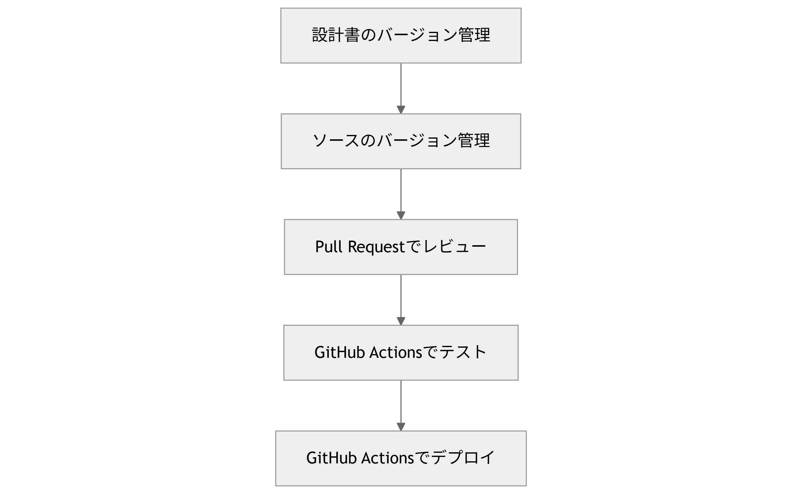

<!-- スライド1: タイトル -->

# 🚀 GitHubを中心とした最新開発スタイルの導入
### 〜 設計からデプロイまでを一元管理 〜

**ITエンジニア向けライトニングトーク**  
Presented by: @tomotoaki

---

<!-- スライド2: 目次 -->

# 📚 目次

1. GitHubの進化と現状
2. Asciidocによる設計書管理
3. コードレビューの自動化
4. GitHub Actionsで実現するCI/CD
5. モダン開発フローの全体像
6. 導入メリットとTips
7. まとめ・Q&A

---

<!-- スライド3: GitHubの進化 -->

# 🧬 GitHubの進化と現状

- 従来: ソースコードのバージョン管理
- 現在:  
  ✅ 設計書管理  
  ✅ コードレビュー支援  
  ✅ CI/CDパイプライン  
  ✅ チームコラボレーション


<div style="font-size: 0.8em;">GitHubは「単なるGitホスティング」ではない。</div>

---

<!-- スライド4: Asciidoc設計書管理 -->

# 📝 Asciidocによる設計書管理

- Asciidocとは？  
  → プレーンテキストで構造化文書を記述できるマークアップ言語
- Git管理に最適：変更履歴・差分が一目瞭然
- GitHub上でプレビュー表示が可能

📌 使用例:
```asciidoc
= 設計書タイトル
:author: エンジニア名
:toc:

== システム概要
本システムは...
````

---

<!-- スライド5: コードレビューの自動化 -->

# 🔍 コードレビューの自動化

## ✅ Pull Request + GitHub Actions

* PR作成時に自動Lint/テスト
* Botによるレビュー補助 \
  (例: Danger, Reviewdog)
* 実行例: PRにコメントで結果通知


品質を「人手＋自動化」で守る。

---

<!-- スライド6: GitHub ActionsのCI/CD -->

# ⚙️ GitHub ActionsでCI/CD

## 構成例:

```yaml
name: CI Pipeline

on: [push, pull_request]

jobs:
  build:
    runs-on: ubuntu-latest
    steps:
      - uses: actions/checkout@v3
      - run: npm install && npm test
```

✅ Pushでテスト → デプロイまで自動化
✅ 複雑なワークフローもYAMLで定義可能

---

<!-- スライド7: モダン開発フロー -->

# 🧭 モダン開発フロー全体像

* 設計・開発・テスト・デプロイの一体化
* すべてを**GitHub中心**で完結可能！



---

<!-- スライド8: 導入メリットとTips -->

# 🎯 導入メリットとTips

### ✅ メリット

* 開発フローの**見える化**
* 自動化による**品質向上と効率化**
* ナレッジが**Gitに集約**

### 💡 Tips

* READMEに設計書へのリンクを明記
* PRテンプレートでレビューポイントを明示
* secretsを使ったセキュアなCD設定

---

<!-- スライド9: まとめ -->

# 🧩 まとめ

* GitHubは開発の**中心プラットフォーム**へ進化
* Asciidoc × GitHubで**設計とコードを一元管理**
* ActionsでCI/CDもシームレスに
* チーム開発の質が劇的に向上！

---

<!-- スライド10: Q&A -->

# ❓ ご質問はありますか？

<div style="font-size: 1.2em; color: #00d1b2;">
📬お気軽にどうぞ！
</div>

---

<!-- スライド11: エンディング -->

# 👏 ご清聴ありがとうございました！

Follow me on GitHub
➡️ [https://github.com/tomotoaki](https://github.com/tomotoaki)
