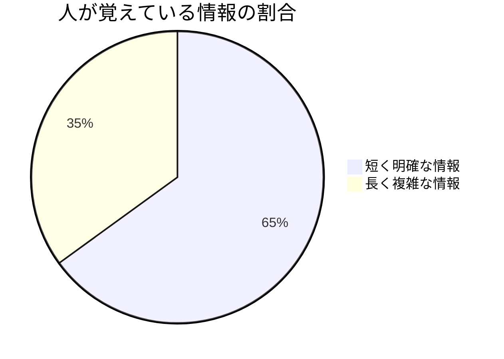

<!-- タイトル＋目次（1枚にまとめる） -->
# Simple  
## 「簡潔さ」は最強の戦略である  
### 〜5分で学ぶスマート・シンプルの極意〜

---

## 目次
1. なぜ「簡潔さ」が最強なのか  
2. スマート・シンプルの定義  
3. 簡潔化の3原則  
4. 実践例（会議／プレゼン／メール）  
5. 成功のポイント  
6. まとめ

---

## 1. なぜ「簡潔さ」が最強なのか

> 情報過多の時代、**「短く・明確に」**が武器になる

- 毎日大量の情報にさらされる → 注意は有限  
- 長い説明は忘れられやすい／短いメッセージは残る

📊 視覚化（比率）

---

## 2. スマート・シンプルとは

> **目的に直結し、不要を削ぎ落とす伝え方**

- **相手視点**で必要なことだけ伝える  
- 1文 = 1メッセージ（結論を先に）  
- 行動（What to do）を明確に提示する

💡 キーワード：短く・少なく・力強く

---

## 3. 簡潔化の3原則

1. **削る** — 余計な背景説明や修飾語を省く  
2. **絞る** — 伝えたいポイントは1つに集中する  
3. **強調する** — 数字・色・太字にて一目でわかるようにする

---

## 4. 実践例（短く・具体的に）

### 会議
- ❌「昨年度からの経緯を説明すると…」  
- ✅「結論：今年は売上20%増を目指します（理由1・施策2）」

### プレゼン
- スライド1枚 = 1メッセージ  
- 画像＋1つの数字で直感に訴える

### メール
- 件名で結論＋期日（例：`明日10時 — 会議資料 完成`）

---

## 5. 成功のポイント

- 相手の**時間を尊重**する（短く終える）  
- 言葉は**平易に**（専門語は必要時のみ）  
- 重要情報は**視覚的に目立たせる**（色・太字・アイコン）  
- シンプルさは**準備と洞察の表れ**

📌 シンプル = 伝える力の最大化

---

## 6. まとめ（実行ワーク）

- 3原則：**削る・絞る・強調する**  
- 話す前に**1文で結論を決める**習慣をつける  
- 今日できること：メールの件名、次のスライド、次回の会議で実践してみる

---

## Thank you!
### Stay Simple, Stay Smart.
